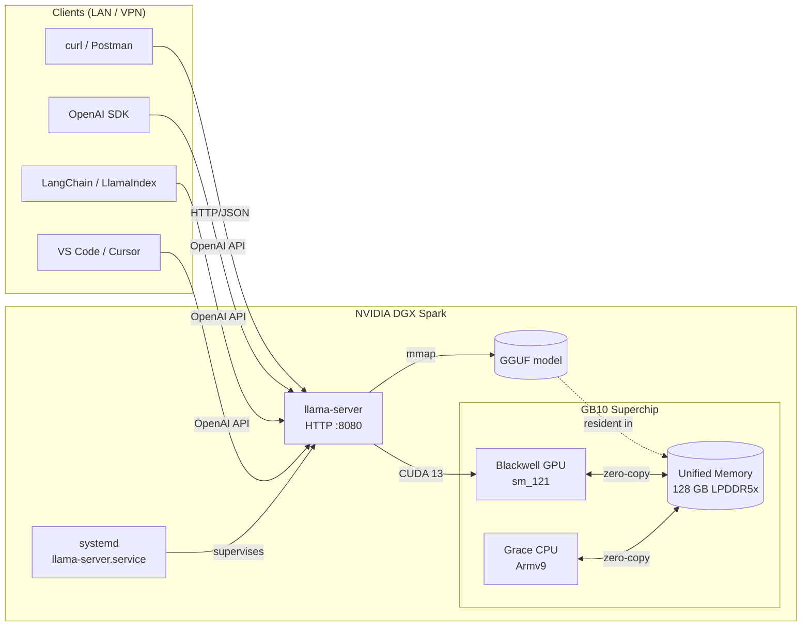

<div align="center">

# 🚀 DGX Spark LLM Stack

### Production-grade local LLM serving on NVIDIA Grace Blackwell GB10
#### `llama.cpp` &middot; CUDA 13 &middot; OpenAI-compatible API &middot; systemd

<br/>

[](https://www.nvidia.com/en-us/products/workstations/dgx-spark/)
[](https://learn.arm.com/learning-paths/laptops-and-desktops/dgx_spark_llamacpp/)
[](https://developer.nvidia.com/cuda-toolkit)
[](https://www.arm.com/architecture/cpu/v9)

[](https://github.com/ggml-org/llama.cpp)
[](https://github.com/ggml-org/ggml/blob/master/docs/gguf.md)
[](https://platform.openai.com/docs/api-reference)
[](https://systemd.io/)
[](LICENSE)
[](CONTRIBUTING.md)
[](https://github.com/engineering87/dgxspark-llm-repo/commits/main)

</div>

---

## 📋 Table of Contents

1. [Why this repository](#-why-this-repository)
2. [Reference hardware](#-reference-hardware)
3. [Architecture](#-architecture)
4. [Prerequisites](#-prerequisites)
5. [Quick start](#-quick-start)
6. [Detailed setup](#-detailed-setup)
   - [Step 1: System dependencies](#step-1-system-dependencies)
   - [Step 2: Verify CUDA toolchain](#step-2-verify-cuda-toolchain)
   - [Step 3: Download a model](#step-3-download-a-model)
   - [Step 4: Build llama.cpp with CUDA](#step-4-build-llamacpp-with-cuda)
   - [Step 5: Smoke test the binary](#step-5-smoke-test-the-binary)
7. [Running the server](#-running-the-server)
8. [API usage](#-api-usage)
9. [Run as a systemd service](#-run-as-a-systemd-service)
10. [Remote access](#-remote-access)
11. [Performance and tuning](#-performance-and-tuning)
12. [Monitoring](#-monitoring)
13. [Troubleshooting](#-troubleshooting)
14. [Security considerations](#-security-considerations)
15. [Project structure](#-project-structure)
16. [Roadmap](#-roadmap)
17. [Contributing](#-contributing)
18. [License](#-license)

---

## 🎯 Why this repository

This repository is a complete, reproducible recipe for serving a local large language model on an NVIDIA DGX Spark workstation. It assembles `llama.cpp` with full GPU offload, an OpenAI-compatible HTTP endpoint, and a hardened `systemd` deployment so that the service survives reboots and is reachable from the local network.

The stack is intentionally minimal:

- **No Python inference runtime.** Inference runs in a single self-contained C++ binary.
- **No external orchestrator.** The OS supervises the process via `systemd`.
- **No vendor lock-in on the model.** Any GGUF checkpoint that fits in memory is supported.
- **Drop-in OpenAI compatibility.** Existing SDKs (`openai`, LangChain, LlamaIndex, autogen, llmx) work without modification.

The result is a quiet, predictable inference node that behaves like a managed API while running entirely on hardware you own.

---

## 🖥️ Reference hardware

This setup has been validated on the configuration below. It works on any machine that meets the constraints in the next section.

| Component | Detail |
|---|---|
| Platform | NVIDIA DGX Spark |
| Superchip | Grace Blackwell **GB10** |
| GPU compute capability | `sm_121` (Blackwell) |
| CPU | ARM Cortex-X925 + Cortex-A725 (Armv9) |
| Vector extensions | SVE2, BF16, I8MM |
| Memory | 128 GB LPDDR5x **unified** (CPU + GPU) |
| Memory bandwidth | ~273 GB/s |
| Driver | NVIDIA 580.x |
| CUDA Toolkit | 13.0 |
| OS | DGX OS (Ubuntu 24.04 LTS, aarch64) |

The GB10 features a **unified memory architecture**: the Grace CPU and the Blackwell GPU share a single physical memory pool. There is no host-to-device copy on inference, and the entire 128 GB pool is addressable from CUDA kernels. This is the property that makes 30B+ class models comfortably resident on a single workstation.

> **Portability note.** The stack runs on any CUDA-capable Linux box with enough VRAM, including discrete GPUs (RTX 4090/5090, H100, A100). On non-Blackwell GPUs, change `CMAKE_CUDA_ARCHITECTURES` to match your card and drop the GB10-specific CPU flags.

---

## 🏗️ Architecture



The data path on a typical request: HTTP request enters `llama-server` &rarr; tokens are appended to the KV cache in unified memory &rarr; CUDA kernels run on the Blackwell GPU &rarr; sampled tokens are streamed back over HTTP. Because memory is unified, there is no PCIe transfer in the hot path.

---

## ✅ Prerequisites

| Requirement | Why |
|---|---|
| NVIDIA driver ≥ 580 | CUDA 13 runtime |
| CUDA Toolkit 13.0 (`nvcc`) | Build toolchain for `ggml-cuda` |
| `gcc` 13+ / `g++` 13+ | C++ build (gcc 15+ recommended for `-mcpu=gb10`) |
| `cmake` ≥ 3.18 | llama.cpp build system |
| `git`, `build-essential` | Source checkout and toolchain |
| ~70 GB free disk | Model download + build artifacts |
| Hugging Face account | Some checkpoints are gated |

Verify everything in one shot:

```bash
nvidia-smi
nvcc --version
cmake --version
gcc --version
df -h /
```

---

## ⚡ Quick start

If you trust the defaults and want a working server in five minutes, run:

```bash
git clone https://github.com/engineering87/dgxspark-llm-repo.git
cd dgxspark-llm-repo
./scripts/install.sh                  # builds llama.cpp with CUDA 13 for GB10
./scripts/run.sh                      # starts llama-server on :8080
```

Then verify:

```bash
curl http://localhost:8080/v1/models
```

The remainder of this README explains each step in detail.

---

## 🔧 Detailed setup

### Step 1: System dependencies

DGX OS ships with most of the toolchain. Install the rest:

```bash
sudo apt update
sudo apt install -y \
    git cmake build-essential \
    python3-pip python3-venv \
    nvtop htop curl jq
```

### Step 2: Verify CUDA toolchain

CUDA 13 must be the active toolchain. DGX OS ships with both 12.x and 13.0 packages, and the default `nvcc` may point to 12.x.

```bash
# Check nvcc path
which nvcc
nvcc --version
```

If `nvcc --version` reports anything other than 13.x, switch the alternative:

```bash
sudo update-alternatives --config cuda
# select cuda-13.0
```

Or use the `cuda-nvcc-13-0` package directly:

```bash
export PATH=/usr/local/cuda-13.0/bin:$PATH
export LD_LIBRARY_PATH=/usr/local/cuda-13.0/lib64:$LD_LIBRARY_PATH
```

### Step 3: Download a model

This recipe uses **Gemma 4 31B IT (NVFP4)** as the reference model. NVFP4 is NVIDIA's native FP4 format with hardware acceleration on Blackwell. Any GGUF model fits the same workflow.

```bash
# Install the Hugging Face CLI
pip install --user huggingface_hub

# Authenticate (only needed for gated models)
huggingface-cli login

# Download into a dedicated directory
sudo mkdir -p /models && sudo chown $USER:$USER /models

huggingface-cli download \
    google/gemma-4-31b-it-gguf \
    --local-dir /models/gemma-4-31b-it \
    --local-dir-use-symlinks False
```

> **Disk budget.** F16 weights for a 31B model are ~62 GB. NVFP4 quantization brings this down to ~16 GB, which leaves ample room in the 128 GB unified pool for a generous KV cache (long context windows).

#### Alternative models that work out of the box

| Model | Size on disk | Notes |
|---|---|---|
| Llama 3.3 70B Q4_K_M | ~40 GB | Strong general assistant |
| Qwen3 32B Dense (F16) | ~62 GB | Bandwidth-bound on GB10 |
| Qwen3 30B-A3B (MoE) | ~18 GB active | MoE workloads excel on Spark (~89 t/s) |
| Mistral Small 3 24B Q5_K_M | ~17 GB | Low latency, strong at code |
| TinyLlama 1.1B Q8_0 | ~1.1 GB | Smoke-test model |

### Step 4: Build llama.cpp with CUDA

```bash
git clone https://github.com/ggml-org/llama.cpp.git
cd llama.cpp

cmake -B build \
    -DCMAKE_BUILD_TYPE=Release \
    -DGGML_CUDA=ON \
    -DGGML_CUDA_F16=ON \
    -DCMAKE_CUDA_ARCHITECTURES=121 \
    -DLLAMA_CURL=ON

cmake --build build -j --config Release
```

The flags matter:

| Flag | Purpose |
|---|---|
| `GGML_CUDA=ON` | Enables the CUDA backend in `ggml`. |
| `GGML_CUDA_F16=ON` | Uses FP16 accumulation where safe. Important throughput gain on Blackwell. |
| `CMAKE_CUDA_ARCHITECTURES=121` | Targets Blackwell (`sm_121`). Without this the build falls back to a generic target and you lose Blackwell-specific kernels. |
| `LLAMA_CURL=ON` | Allows `llama-server` to fetch GGUFs by URL. |

Build time on GB10 is roughly 4–6 minutes for a parallel build.

> **GB10 native CPU optimization.** With `gcc` 15 or `clang` 21+, append `-DCMAKE_C_FLAGS="-mcpu=gb10" -DCMAKE_CXX_FLAGS="-mcpu=gb10"` to enable Cortex-X925/A725 specific tuning and crypto extensions. DGX OS ships gcc 14 by default; install gcc-15 from the toolchain PPA if you want this.

### Step 5: Smoke test the binary

```bash
./build/bin/llama-cli \
    -m /models/gemma-4-31b-it/gemma-4-31b-it-nvfp4.gguf \
    -ngl 999 \
    -p "Reply with the single word OK." \
    -n 4
```

If you see `OK` and `nvtop` shows GPU utilization, the build is correct.

---

## 🚦 Running the server

The reference command:

```bash
./build/bin/llama-server \
    --model /models/gemma-4-31b-it/gemma-4-31b-it-nvfp4.gguf \
    --ctx-size 16384 \
    --n-gpu-layers 999 \
    --host 0.0.0.0 \
    --port 8080 \
    --threads 16 \
    --parallel 4 \
    --batch-size 2048 \
    --ubatch-size 512 \
    --flash-attn \
    --metrics
```

### Flag reference

| Flag | Meaning | Recommended value on GB10 |
|---|---|---|
| `--model` | Path to the GGUF checkpoint | absolute path |
| `--ctx-size` | Context window in tokens | 8192–131072 depending on model |
| `--n-gpu-layers` | Layers offloaded to GPU. `999` means "all". | `999` |
| `--host` | Bind address. `0.0.0.0` exposes on the LAN. | `0.0.0.0` for LAN, `127.0.0.1` for localhost only |
| `--port` | TCP port | `8080` |
| `--threads` | CPU threads for non-offloaded ops | `16` (8 perf + 8 efficiency cores on Grace) |
| `--parallel` | Concurrent request slots | `2`–`8` depending on context size |
| `--batch-size` / `--ubatch-size` | Prefill chunking | `2048` / `512` |
| `--flash-attn` | Flash Attention kernels | always on for Blackwell |
| `--metrics` | Exposes `/metrics` (Prometheus) | enable for monitoring |

### Validation

```bash
# Health
curl -s http://localhost:8080/health | jq

# Loaded model
curl -s http://localhost:8080/v1/models | jq

# Prometheus metrics
curl -s http://localhost:8080/metrics | head -20
```

---

## 🔌 API usage

`llama-server` exposes the OpenAI Chat Completions, Completions, and Embeddings endpoints. Existing client SDKs work by changing only the `base_url`.

### cURL

```bash
curl http://localhost:8080/v1/chat/completions \
    -H "Content-Type: application/json" \
    -d '{
        "model": "gemma-4-31b-it",
        "messages": [
            {"role": "system", "content": "You are a concise technical assistant."},
            {"role": "user",   "content": "Explain microservices in three bullet points."}
        ],
        "temperature": 0.2,
        "max_tokens": 256
    }' | jq
```

### Python (official OpenAI SDK)

```python
from openai import OpenAI

client = OpenAI(
    base_url="http://localhost:8080/v1",
    api_key="not-required",          # llama-server ignores the key by default
)

response = client.chat.completions.create(
    model="gemma-4-31b-it",
    messages=[
        {"role": "system", "content": "You are a concise technical assistant."},
        {"role": "user",   "content": "Explain microservices in three bullet points."},
    ],
    temperature=0.2,
)

print(response.choices[0].message.content)
```

### TypeScript / Node.js

```typescript
import OpenAI from "openai";

const client = new OpenAI({
    baseURL: "http://localhost:8080/v1",
    apiKey:  "not-required",
});

const stream = await client.chat.completions.create({
    model: "gemma-4-31b-it",
    messages: [
        { role: "user", content: "Stream me a haiku about distributed systems." },
    ],
    stream: true,
});

for await (const chunk of stream) {
    process.stdout.write(chunk.choices[0]?.delta?.content ?? "");
}
```

### C# / .NET

```csharp
using OpenAI;
using OpenAI.Chat;

var client = new ChatClient(
    model: "gemma-4-31b-it",
    credential: new ApiKeyCredential("not-required"),
    options: new OpenAIClientOptions { Endpoint = new Uri("http://localhost:8080/v1") }
);

ChatCompletion completion = await client.CompleteChatAsync(
    "Explain microservices in three bullet points."
);

Console.WriteLine(completion.Content[0].Text);
```

---

## 🛠️ Run as a systemd service

A reference unit file is provided in [`systemd/llama-server.service`](systemd/llama-server.service). Install it with:

```bash
sudo cp systemd/llama-server.service /etc/systemd/system/
sudo systemctl daemon-reload
sudo systemctl enable --now llama-server
```

Common operations:

```bash
sudo systemctl status llama-server      # current state
sudo systemctl restart llama-server     # restart after a config change
sudo systemctl stop llama-server        # stop the service
journalctl -u llama-server -f           # live logs
journalctl -u llama-server --since '10 min ago'
```

The unit ships with sane defaults: `Restart=on-failure`, `RestartSec=10s`, `LimitNOFILE=65536`, isolated working directory, and an `EnvironmentFile` you can edit to change model and flags without touching the unit itself. See the file for the full set of hardening options.

---

## 🌐 Remote access

To expose the service to other machines on the LAN:

```bash
hostname -I        # find the LAN IP, e.g. 192.168.1.42
```

Clients then point at `http://192.168.1.42:8080`. If a firewall is active:

```bash
sudo ufw allow from 192.168.1.0/24 to any port 8080 proto tcp
```

For access outside the LAN, **do not** expose the port directly to the public internet. Use one of:

- **WireGuard / Tailscale** for a private mesh.
- **Cloudflare Tunnel** for a zero-trust HTTPS endpoint.
- **nginx reverse proxy** with TLS and basic auth on the same host.

A minimal nginx snippet is provided in [`docs/nginx-reverse-proxy.conf.example`](docs/nginx-reverse-proxy.conf.example).

---

## 📊 Performance and tuning

Approximate throughput on GB10 with full GPU offload (single client, batch 1):

| Model | Quant | Ctx | Prefill (t/s) | Decode (t/s) |
|---|---|---|---|---|
| Gemma 4 31B IT | NVFP4 | 16k | ~600 | ~28 |
| Llama 3.3 70B | Q4_K_M | 8k | ~250 | ~9 |
| Qwen3 32B Dense | F16 | 8k | ~220 | ~10.7 |
| Qwen3 30B-A3B (MoE) | F16 | 8k | ~340 | ~89 |
| Mistral Small 3 24B | Q5_K_M | 8k | ~480 | ~22 |

Numbers are indicative and depend on prompt length, batch settings, and concurrency. MoE models dramatically outperform dense models of equivalent size on GB10 because the limiting factor on dense decoding is memory bandwidth (~273 GB/s), while MoE activates only a fraction of the parameters per token.

### Tuning levers

- **Quantization.** NVFP4 and Q4_K_M are the sweet spot for most use cases. Q8_0 doubles memory and bandwidth use for marginal quality gain.
- **Context size.** KV cache scales linearly with `--ctx-size` and quadratically with concurrent slots. A 131k context with `--parallel 4` can easily consume more memory than the model itself.
- **Flash Attention.** Always on for Blackwell. There is no scenario where disabling it helps.
- **Prefill batch.** Larger `--batch-size` accelerates long-prompt prefill at the cost of memory. 2048 is a good default on GB10.

---

## 📈 Monitoring

### Live GPU view

```bash
nvtop                       # interactive
nvidia-smi -l 1             # one-line refresh
```

### Prometheus metrics

`llama-server` exposes `/metrics` when started with `--metrics`. Sample scrape config:

```yaml
scrape_configs:
    - job_name: llama-server
      static_configs:
          - targets: ["spark.local:8080"]
```

Key series to chart: `llamacpp:prompt_tokens_total`, `llamacpp:tokens_predicted_total`, `llamacpp:requests_processing`, `llamacpp:n_decode_total`.

A reference Grafana dashboard is provided in [`docs/grafana-dashboard.json`](docs/grafana-dashboard.json).

---

## 🧯 Troubleshooting

| Symptom | Likely cause | Fix |
|---|---|---|
| `nvcc fatal: unsupported gpu architecture 'compute_121'` | CUDA toolchain is 12.x | Install `cuda-nvcc-13-0`, switch with `update-alternatives` |
| `ptxas ... error: Instruction 'mma with block scale'` | gcc/llvm too old for Blackwell | Update to gcc 15 or pin `CMAKE_CUDA_ARCHITECTURES=120` |
| Model loads on CPU only | `--n-gpu-layers` not set or 0 | Use `--n-gpu-layers 999` |
| `bind: address already in use` | Port 8080 occupied | `sudo lsof -i :8080`, change `--port` or kill the process |
| Hangs on first request | KV cache allocating | Wait 10–20s, then time subsequent calls |
| OOM at large context | KV cache exceeds free memory | Reduce `--ctx-size`, `--parallel`, or use a smaller quant |
| `llama-server` not in `journalctl` | Unit file path wrong | `sudo systemctl cat llama-server` to verify |

---

## 🔒 Security considerations

The default configuration assumes a **trusted LAN**. Before exposing the service more broadly, harden it:

- **Bind to `127.0.0.1`** and put a reverse proxy (nginx, Caddy, Traefik) in front.
- **Add an API key** with `--api-key <secret>` and rotate it periodically.
- **Terminate TLS** at the proxy, never at `llama-server` directly.
- **Rate-limit** at the proxy layer to mitigate abuse.
- **Audit prompts and outputs** if processing sensitive data, even for local-only deployments.

The service stores no data by default. Logs only contain request metadata, not full prompts or completions, unless you raise the verbosity.

---

## 🌳 Project structure

```
dgxspark-llm-repo/
├── README.md                          # this file
├── LICENSE                            # MIT
├── CONTRIBUTING.md                    # contribution guidelines
├── .gitignore
├── scripts/
│   ├── install.sh                     # toolchain check + llama.cpp build
│   ├── run.sh                         # foreground launcher
│   └── download-model.sh              # Hugging Face download helper
├── systemd/
│   ├── llama-server.service           # unit file
│   └── llama-server.env               # environment overrides
├── docs/
│   ├── ARCHITECTURE.md                # deeper dive on the data path
│   ├── nginx-reverse-proxy.conf.example
│   └── grafana-dashboard.json
└── .github/
    └── workflows/
        └── shellcheck.yml             # lint the shell scripts on PR
```

---

## 🗺️ Roadmap

- [ ] Multi-model routing via a thin gateway
- [ ] vLLM comparison playbook on the same hardware
- [ ] OpenWebUI compose stack
- [ ] Automatic model warm-up on service start
- [ ] HTTPS termination recipe with Caddy
- [ ] Benchmark harness with `llama-bench` automation

---

## 🤝 Contributing

Issues and pull requests are welcome. See [CONTRIBUTING.md](CONTRIBUTING.md) for the workflow. The short version: open an issue first if the change is non-trivial, keep PRs focused, and run `shellcheck` on any shell script you touch.

---

## 📄 License

Released under the [MIT License](LICENSE). The licenses of the bundled tooling (`llama.cpp`, NVIDIA CUDA, downloaded model weights) apply to their respective components and are not modified by this repository.

---

<div align="center">

**Built and maintained by [@engineering87](https://github.com/engineering87)**

If this saved you a weekend of yak-shaving, drop a ⭐ on the repo.

</div>
